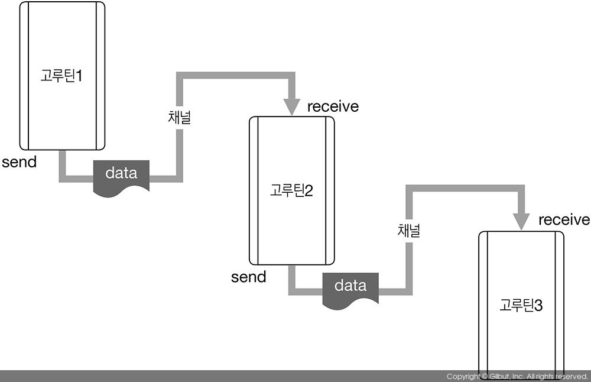

# 5장 병행 처리

- goroutine
- channel

## 5.1 고루틴

`goroutine`

- go 프로그램 안에서 동시에 독립적으로 실행되는 흐름의 단위
- 스레드와 비슷하지만, 고루틴은 아주 적은 리소스에서 동작함
  - 따라서, 한 프로세스에 수천 수만개의 고루틴 동작 가능
- Lock으로 공유메모리 관리할 필요 X
- 구현도 쉬움

```go
go f(x,y)
```

예제

```go
func main() {
  fmt.Println("main 함수 시작", time.Now())

  go long()
  go short()

  time.Sleep(5 * time.Second)
  fmt.Println("main 함수 종료", time.Now())
}

func long() {
  fmt.Println("long 함수 시작", time.Now())
  time.Sleep(3 * time.Second)
  fmt.Println("long 함수 종료", time.Now())
}

func short() {
  fmt.Println("short 함수 시작", time.Now())
  time.Sleep(1 * time.Second)
  fmt.Println("short 함수 종료", time.Now())
}

// goroutine을 사용하지 않는다면
// long()에서 5초
// short()에서 1초
// main() 뒷부분에서 5초 대기하여
// = 총 11초를 대기한 후 프로그램이 종료될 것이다.

// 하지만 goroutine을 이용하면
// 5초, 1초, 5초 가 병렬로 실행되어
// 총 5초를 대기한 후 프로그램이 종료된다.
```

### 고루틴 사용시 주의사항 !

- 실행중이 고루틴이 있어도, **메인 함수가 종료되면 프로그램이 종료**됨
- 이와같은 상황을 방지하기 위해 어떻게 해야 하는가?
  - 메인함수에서 충분히 긴 시간을 대기하는 것은 비효율적
  - **채널**을 활용해 대기시키는 것을 권장한다.

## 5.2 채널

`channel`

- 목적 :
  - 고루틴끼리
    1. 정보 교환
    2. 실행 흐름 동기화
  - 하기 위해 사용한다



- 사용하는 방법

  - 일반 변수처럼 선언하고, `make()` 로 생성
  - `chan` 키워드로 채널을 통해 주고받을 데이터 타입 설정 필요
  - ```go
    // 채널 변수 선언 후 make()로 채널 생성
    var ch chan string
    ch = make(chan string)

    // make()로 생성 후 바로 할당
    done = make(chan bool)

    // 타입에 상관없이 주고받고 싶다면?
    ch2 = make(chan interface{})
    ```

  - 채널로 데이터를 주고받는 방법
  - ```go
    ch <- "msg" // ch 채널에 전송
    m := <- ch // ch 채널로부터 수신
    ```

고루틴 파트에서 작성한 예제를 수정해보자

```go
func main() {
  fmt.Println("main 함수 시작", time.Now())

  done := make(chan bool)

  // 1. 각 함수로 done 채널 전달
  go long(done)
  go short(done)

  // 3. done 채널로부터 메세지 받고 프로그램 종료
  <- done
  <- done
  fmt.Println("main 함수 종료", time.Now())
}

func long(done chan bool) {
  fmt.Println("long 함수 시작", time.Now())
  time.Sleep(3 * time.Second)
  fmt.Println("long 함수 종료", time.Now())
  done <- true // 2. 처리 완료 후 done채널로 완료 메세지 전달
}

func short(done chan bool) {
  fmt.Println("short 함수 시작", time.Now())
  time.Sleep(1 * time.Second)
  fmt.Println("short 함수 종료", time.Now())
  done <- true // 2. 처리 완료 후 done채널로 완료 메세지 전달
}
```

### 교착상태에 대한 위험

동시성을 처리할 때, 저수준 기능(뮤텍스, lock 등)이 아니라 채널을 이용한다고 해도, 교착상채(deadlock)에 대한 위험성은 남아있다.

교착상태와 경쟁상태(race condition)을 테스트하기 위한 사이트

- [Race Detector](https://golang.org/doc/articles/race_detector.html)
- `-race` 플래그와 함께 go 프로그램을 실행하면 경쟁상태를 확인해줌

### 채널 사용시 주의할 점

- 채널도 함수와 마찬가지로 `call by value` 방식이다.
  - 그래서 bool, int 등의 값을 전달하는 것은 안전함
- 하지만 `call by reference`로 동작하는 변수를 사용할 때는, 값을 전달하는 고루틴과 전달받는 고루틴에서 동시에 수정하지 않도록 주의해야 함
  - 포인터 변수
  - 참조 값 (슬라이스, 맵 )
- 동시에 변경할 위험이 있는 경우, 값을 직접 전달하는 대신 인터페이스를 전달하는 것도 좋은 방법

  - `stringMap`의 값을 변경할 필요가 없는 고루틴에는 `mapGetter`인터페이스를 채널로 전달해 실수 방지

  ```go
  type mapGetter interface {
      Get(s string) interface{}
  }

  type stringMap map[string]interface{}

  func (m stringMap) Get(s string) interface{} { return m[s] }
  ```

### 5.2.1 채널 방향

- 채널은 기본적으로 양방향 통신 가능
- but, 실제로는 대부분 단방향으로 사용
- 단방향으로 지정해 사용하자

```go
chan<- string // 송신 전용 (주기만 함)
<-chan string // 수신 전용 (받기만 함)
```

### 5.2.2 버퍼드 채널

- 채널은 특정 크기의 버퍼를 가질 수 있음
- 채널 생성 시 지정 가능
- 지정하지 않을 경우 `기본값 0`

```go
ch := make(chan int, 100) // 두 번째 매개변수가 버퍼의 크기
```

- 버퍼드 채널은 비동기 방식으로 동작
- 채널이 가득 찰때 까지, 계속 전송하고
- 채널이 빌 때까지, 계속 수신 가능

```go
func main() {
    ch := make(chan int, 2) //

    ch <- 1
    ch <- 2
    // 버퍼가 가득 참

    ch <- 3 // 버퍼가 빌 때 까지 대기
    // 영원히 진행되지 않음 ㅜㅜ
}
```

### 5.2.3 close & range

- close
  - 채널에 더 이상 전송할게 없으면 닫을 수 있음
  - `close(ch)`
  - 채널 수신자측에서, 채널이 닫혔는지 확인하는 방법
    ```go
    v, ok := <-ch // ok로 확인
    ```
- range
  - 채널이 닫힐 때 까지 반복하며, 채널로부터 수신 시도
  - `for i := range ch`
- 채널을 닫는 행위는 필수가 아님
  - 수신자가 채널에 더 이상 들어올 값이 없다는 것을 알아야만 할 때 (ex range) 닫아주면 됨

### 5.2.4 select

- 하나의 고루틴이 여러 채널과 통신할 때 사용
- case로 여러 채널을 대기하다가 실행 가능상태가 된 채널을 수행

```go
func fibonacci(c, quit chan int) {
    x, y := 0, 1
    for {
        select {
        case c <- x:
            // main에서 수신하지 않을경우,  채널이 비지 않아 한번에 한개씩만 전송할 수 있음
            x, y = y, x+y
        case <-quit:
            fmt.Println("quit")
            return
        }
    }
}

func main() {
    c := make(chan int)
    quit := make(chan int)
    go func() {
        for i := 0; i < 10; i++ {
            fmt.Println(<-c)
        }
        quit <- 0
    }()
    fibonacci(c, quit)
}
```

- `default` 케이스
  - case에 지정된 모든 채널이 사용불가 상태일 때 default case가 수행됨

```go
func main() {
	tick := time.Tick(100 * time.Millisecond)
	boom := time.After(500 * time.Millisecond)
	for {
		select {
		case <-tick:
			fmt.Println("tick.")
		case <-boom:
			fmt.Println("BOOM!")
			return
		default:
			fmt.Println(" .")
			time.Sleep(50 * time.Millisecond) // sleep이 없을경우 .가 무한출력됨
		}
	}
}
```

## 5.3 저수준 제어

뮤택스와 원자성 제어할 수 있는 저수준 제어 기능도 있음

### 5.3.1 sync.Mutex

## 5.4 활용
